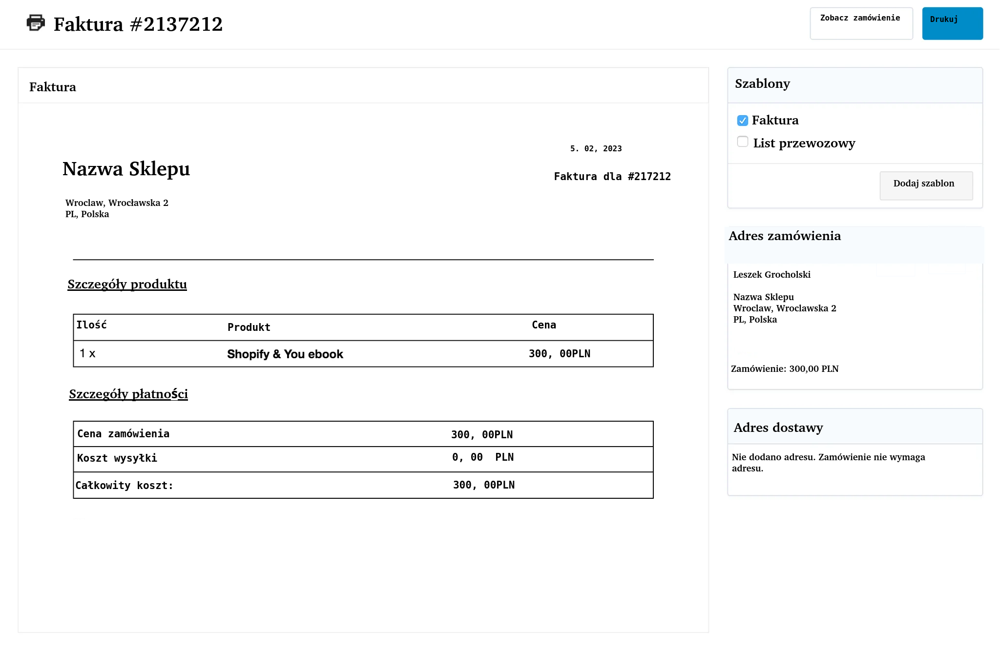
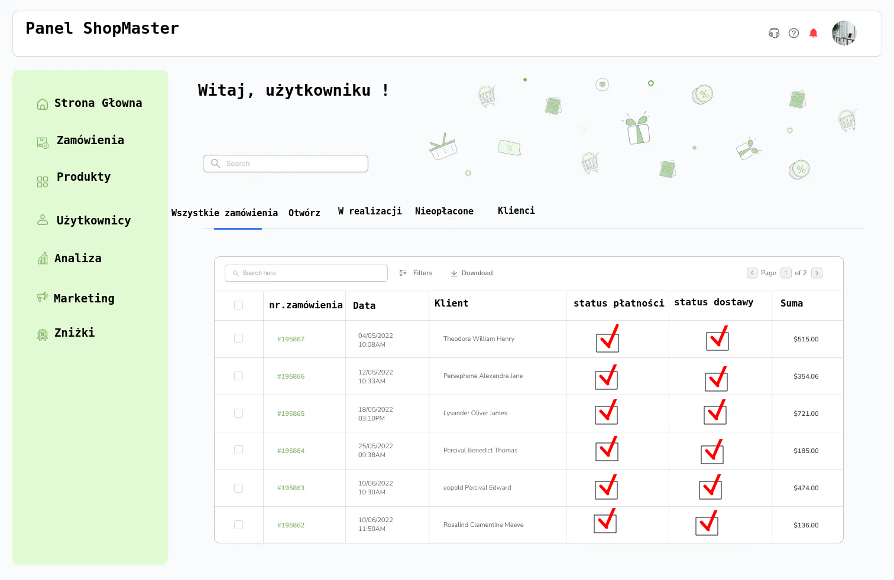
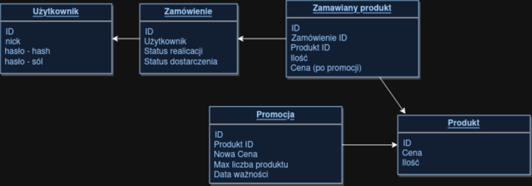

**1. Zarządzanie Produktami:**

a. **Dodawanie Nowego Produktu:**
   1. Administrator loguje się do panelu zarządzania sklepem.
   2. Wybiera opcję "Dodaj nowy produkt".
   3. Wprowadza nazwę, opis, zdjęcie, cenę, ilość i inne szczegóły produktu.
   4. Zapisuje zmiany, co powoduje dodanie produktu do oferty sklepu.

b. **Edycja Istniejącego Produktu:**
   1. Administrator loguje się do panelu zarządzania sklepem.
   2. Wybiera opcję "Edytuj produkty".
   3. Wybiera produkt, którego chce edytować.
   4. Wprowadza nowe dane produktu.
   5. Zapisuje zmiany, co aktualizuje informacje o produkcie.

c. **Usuwanie Produktu:**
   1. Administrator loguje się do panelu zarządzania sklepem.
   2. Wybiera opcję "Edytuj produkty".
   3. Wybiera produkt, który chce usunąć.
   4. Potwierdza decyzję o usunięciu produktu.

d. **Zarządzanie Cenami i Stanem Magazynowym:**
   1. Administrator loguje się do panelu zarządzania sklepem.
   2. Wybiera opcję "Zarządzaj cenami i stanem magazynowym".
   3. Aktualizuje ceny i ilość produktów w magazynie.
   4. Zapisuje zmiany, co aktualizuje informacje na stronie sklepu.

**2. Zamówienia i Płatności:**

a. **Składanie Zamówienia Online:**
   1. Klient przegląda ofertę sklepu.
   2. Dodaje produkty do koszyka.
   3. Przechodzi do opcji "Złóż zamówienie".
   4. Wprowadza dane dostawy i płatności.
   5. Potwierdza zamówienie, co generuje potwierdzenie zamówienia.

b. **Obsługa Płatności Elektronicznych:**
   1. Klient wybiera formę płatności podczas składania zamówienia.
   2. Wprowadza dane karty, informacje o przelewie lub korzysta z systemu płatności elektronicznych.
   3. System przetwarza płatność, a klient otrzymuje potwierdzenie.

**3. Generowanie Faktur:**

a. **Automatyczne Generowanie Faktur:**
   1. System automatycznie generuje fakturę po złożeniu zamówienia.
   2. Faktura zawiera numer zamówienia, dane klienta, adres dostawy, szczegóły produktów i sumę do zapłaty.
   3. Faktura jest dostępna do przeglądania i pobierania z panelu klienta.

b. **Generowanie Faktur Przez Administratora:**
   1. Administrator loguje się do panelu zarządzania sklepem.
   2. Wybiera opcję "Generuj faktury".
   3. Wybiera zakres czasowy lub konkretne zamówienia do rozliczenia.
   4. System generuje faktury dla wybranych zamówień.

**4. Promocje i Kody Rabatowe:**

a. **Tworzenie Nowych Promocji:**
   1. Administrator loguje się do panelu zarządzania sklepem.
   2. Wybiera opcję "Twórz nową promocję".
   3. Wprowadza szczegóły promocji, takie jak zniżka procentowa czy darmowa wysyłka.
   4. Zapisuje promocję, co sprawia, że jest ona widoczna dla klientów.

b. **Korzystanie z Kodów Rabatowych:**
   1. Klient otrzymuje kod rabatowy (np. z newslettera).
   2. Podczas składania zamówienia, wpisuje kod rabatowy w odpowiednim polu.
   3. System oblicza zniżkę, a klient widzi nową sumę do zapłaty.

## Projekty ektranów:

## Architektura systemu:

Aplikacja sklepu internetowego zostanie zaimplementowana w języku programowania Java, korzystając z frameworka Spring oraz narzędzi programistycznych, takich jak IntelliJ IDEA. Frontend sklepu będzie oparty na technologii Angular, umożliwiającej tworzenie responsywnego interfejsu użytkownika dostępnego na różnych urządzeniach. Komunikacja między frontendem a backendem będzie realizowana poprzez zdefiniowane interfejsy API RESTful.

Backend sklepu będzie odpowiedzialny za zarządzanie produktami, obsługę zamówień, płatności oraz generowanie faktur. System zarządzania bazą danych oparty będzie na relacyjnej bazie danych MySQL, umożliwiającej efektywne przechowywanie i szybki dostęp do danych.

Aby zabezpieczyć system przed atakami i utratą danych, zostaną zaimplementowane mechanizmy uwierzytelniania i autoryzacji, a dane klientów będą przechowywane zgodnie z aktualnymi standardami bezpieczeństwa. Dodatkowo, wdrożone będą regularne audyty bezpieczeństwa w celu monitorowania i zabezpieczania systemu przed potencjalnymi zagrożeniami.

W celu zautomatyzowania procesu wdrażania zmian i testowania, skorzystamy z narzędzi CI/CD (Continuous Integration/Continuous Deployment), takich jak Jenkins lub GitHub CI. Każdy nowy Pull Request będzie automatycznie testowany, a po zatwierdzeniu zmiany będą wdrażane na serwerze produkcyjnym.

Poniżej przedstawiony jest schematyczny diagram bazy danych, ukazujący strukturę relacyjną pomiędzy głównymi encjami, takimi jak Produkt, Zamówienie, Klient oraz Promocja.

## Główne zasady kodowania

Zgodnie z zastosowanymi praktykami programowania w naszym projekcie sklepu internetowego, przyjęliśmy pewne kluczowe zasady kodowania, które mają na celu zwiększenie czytelności, utrzymanie spójności oraz ułatwienie potencjalnego rozwoju zespołu programistycznego. Poniżej przedstawiamy główne zasady dotyczące kodowania w naszym projekcie:

1. **Język Programowania:**
   - Kod oraz wszystkie komentarze powinny być pisane w języku angielskim, co obejmuje zarówno same fragmenty kodu, jak i wszelkie komunikaty czy dokumentację.
   - Aplikacja sklepu internetowego będzie napisana w języku JavaScript, co gwarantuje uniwersalność oraz ułatwia potencjalne rozszerzenie zespołu programistycznego.

2. **Standardy Kodowania w Języku JavaScript:**
   - Nazwy klas i metod powinny być zapisywane w konwencji Pascal Case (np. `class ProductService`, `function processOrder()`).
   - Nazwy argumentów i zmiennych lokalnych powinny być zapisywane w konwencji Camel Case (np. `const orderDate`, `let itemCount`).
   - Preferowane jest użycie zmiennych predefiniowanych danego języka, a nie ich równoważników systemowych (np. `let` zamiast `var`).
   - Nazwy interfejsów powinny zaczynać się od litery 'I' (np. `IProductService`).

3. **Zastosowanie Wzorca MVVM w Xamarin:**
   - Xamarin wykorzystuje wzorzec Model-View-ViewModel (MVVM) do separacji logiki prezentacji od biznesowej i interfejsu użytkownika.
   - Należy dbać o jednostronne przypisywanie stron (np. test, nauka) do jednego widoku modelu, aby utrzymać czytelność i modularność kodu.
   - Kod w plikach `.jsx` powinien zawierać jedynie inicjalizację konstruktora, tworzenie modelu widoku, przypisanie kontekstu danych do modelu widoku oraz wywołanie metody `initialize`.

4. **Zarządzanie Kodem Źródłowym w Repozytorium Git:**
   - Cały projekt będzie przechowywany w prywatnym repozytorium na platformie GitHub, dostępnym dla programistów, testerów i zarządu.
   - Wszelkie zmiany w kodzie powinny być wprowadzane poprzez osobne branch'e, a po zakończeniu prac merge'owane z gałęzią `master`.
   - Każdy commit powinien dotyczyć jak najmniejszej ilości plików, co przyspieszy proces rewizji kodu oraz ułatwi śledzenie i wprowadzanie zmian.
   - Nazwy commitów powinny być pisane w języku angielskim, w czasie teraźniejszym, zawierając zwięzły opis wprowadzanych zmian (np. "Introduce product search functionality")."

5. Identyfikacja i Zasady Zarządzania Ryzykiem

W procesie identyfikacji ryzyka dla naszego projektu sklepu internetowego wyodrębniliśmy potencjalne zagrożenia, które mogą wpłynąć na pomyślne jego wdrożenie. Poniżej przedstawiamy wybrane ryzyka oraz zasady zarządzania nimi:

## Identyfikacja i zasady zarządania ryzykiem

1. **Przeciążenie Serwerów:**
   - *Opis Ryzyka:* Istnieje możliwość przeciążenia serwerów w wyniku nagłego wzrostu liczby użytkowników, szczególnie po rozpoczęciu akcji reklamowej.
   - *Prawdopodobieństwo:* Niskie (na początku istnienia aplikacji), średnie/wysokie (po akcji reklamowej).
   - *Zapobieganie:* Monitorowanie aktywności użytkowników, skalowalność serwerów w zależności od potrzeb, planowanie awaryjnych procedur.

2. **Niedotrzymanie Terminu Ukończenia:**
   - *Opis Ryzyka:* Ryzyko nieterminowego ukończenia projektu wynikające z nieefektywnego monitorowania postępów lub błędnej alokacji czasu na poszczególne etapy.
   - *Prawdopodobieństwo:* Średnie/wysokie.
   - *Zapobieganie:* Regularne monitorowanie postępów, elastyczne planowanie czasu, wczesne wykrywanie opóźnień i dostosowywanie harmonogramu.

### zasady zarządzania ryzykiem

1. **Monitorowanie Aktywności Użytkowników:**
   - Stworzymy mechanizmy monitorujące aktywność użytkowników w czasie rzeczywistym, aby szybko zidentyfikować potencjalne wzrosty ruchu na serwerach.

2. **Skalowalność Serwerów:**
   - Zastosujemy elastyczne rozwiązania infrastrukturalne, umożliwiające dynamiczne dostosowywanie zasobów serwerowych do zmieniających się potrzeb.

3. **Planowanie Awaryjnych Procedur:**
   - Przygotujemy plan awaryjny w razie przeciążenia serwerów, obejmujący szybkie skalowanie zasobów oraz ewentualne przenoszenie ruchu na zapasowe serwery.

4. **Regularne Monitorowanie Postępów:**
   - Ustanowimy system regularnego monitorowania postępów, wykorzystując narzędzia do śledzenia zadaniowego postępu w czasie rzeczywistym.

5. **Elastyczne Planowanie Czasu:**
   - Przyjęcie podejścia do elastycznego planowania, umożliwiającego dostosowywanie harmonogramu w zależności od aktualnych potrzeb i priorytetów.

6. **Wczesne Wykrywanie Opóźnień:**
   - Implementacja mechanizmów wczesnego wykrywania opóźnień, umożliwiających szybką reakcję i podjęcie niezbędnych działań naprawczych.

Wprowadzenie powyższych zasad pozwoli nam skutecznie zarządzać ryzykami, minimalizując negatywne skutki oraz zapewniając terminowe i efektywne ukończenie projektu.

## Ocena zgodności
Prace sklepu internetowego są zgodne z pierwotnymi planami i specyfikacją. Nie przewidujemy konieczności większych zmian. Działania zespołu pozwoliły na efektywne osiągnięcie celów bez większych odchyleń. 
